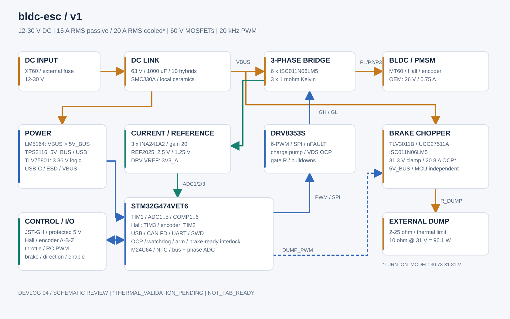

# BLDC ESC

## A custom STM32 motor controller for BLDC and PMSM motors.

I want to build a small vesc like controller, with hall sensors, current sensing, regen, and enough hardware to try FOC later. The first motor is a 26 V Groschopp gearmotor, but the board should be useful for other motors too.

## status

went through the power, protection and sensing circuits again. there's 16 subsheets now, all on A3 or A4. the footprints are assigned and on the pcb in a staging grid

fixed some part/footprint mismatches, changed the hardware comparators, added buffers for the external analog inputs, and made the bridge depend on the brake chopper being ready. the temperature, brake protection and reset circuits have their own pages too

ERC is clean and the schematic and pcb connections match. PCBWay is the planned fab. the usb hole clearance and buck thermal-via checks pass with the project rules now

this is still a review checkpoint, not a finished board. the reference's low-voltage headroom, final BOM and connector fit checks are still open before freezing the schematic. placement, routing, firmware and bench testing haven't started

the detailed checks and remaining limits are in [engineering/review_m03.md](engineering/review_m03.md)

Progress is in [journal.md](journal.md).

## specs

- 12-30V input, mainly for 6S batteries and 24V systems
- 15A RMS phase current with passive cooling, 20A with airflow or a heat spreader
- Around 40A peak, with the allowed duration still to be worked out
- 60V MOSFETs and 63V DC-link capacitors
- 4 layers, 2 oz outer copper and 1 oz inner copper
- XT60 power input, MT60 motor connection, and JST-GH signal connectors

the current ratings are targets until thermal testing is done

## planned hardware

- STM32G474VET6 MCU
- DRV8353S gate driver and six external MOSFETs
- 3 1 milliohm Kelvin shunts, INA241A2 current amplifiers, and voltage/temperature sensing
- Hardware overcurrent shutdown and an external watchdog
- Brake chopper for an external dump resistor
- Hall sensors and quadrature encoder inputs
- Analog throttle, RC PWM, brake, direction, and enable inputs
- CAN FD, UART, USB-C, and SWD
- EEPROM for configuration and debug LEDs

The initial parts and alternatives are in [engineering/parts.csv](engineering/parts.csv), with references in [engineering/sources.csv](engineering/sources.csv)

## block diagram

(made this in inkscape!)

## test motor

Groschopp / Blue-White BL6560-PS2120:

- Blue-White #90010-338, P/N 930-23-9002
- 26 V, 0.75 A nameplate
- 10 W reducer output, 125 RPM, 6.68 in-lb torque
- 20:1 gearbox
- 3 phase leads P1, P2, and P3, and a separate sensor thingy

motor data and measurements are in [engineering/motor.csv](engineering/motor.csv) and [engineering/measurements.csv](engineering/measurements.csv).

## roadmap

- [x] Research the motor family and choose the initial architecture
- [x] Set up the repo, KiCad project, calculations, and draft pinmap
- [x] Draw the complete schematic and assign footprints
- [x] First review of protection, power-up behavior, current sensing, and regen
- [ ] Close the remaining reference/BOM/connector checks and freeze the schematic
- [ ] Place and route the PCB
- [ ] Review the layout and make production files
- [ ] Bring up the MCU, telemetry, Hall inputs, and gate driver
- [ ] Run sensored six-step with current limiting, then speed control
- [ ] Test regen and current control
- [ ] Add sensored FOC, then a sensorless observer and startup

## repo structure

- `bldc-esc.kicad_pro` / `.kicad_sch` / `.kicad_pcb`: main KiCad project
- `schematic/`: 16 circuit subsheets
- `engineering/`: requirements, parts, sources, calculations, pinmap, and review checks
- `journal.md`: devlogs
- `production/`: will be added when there are fabrication files
