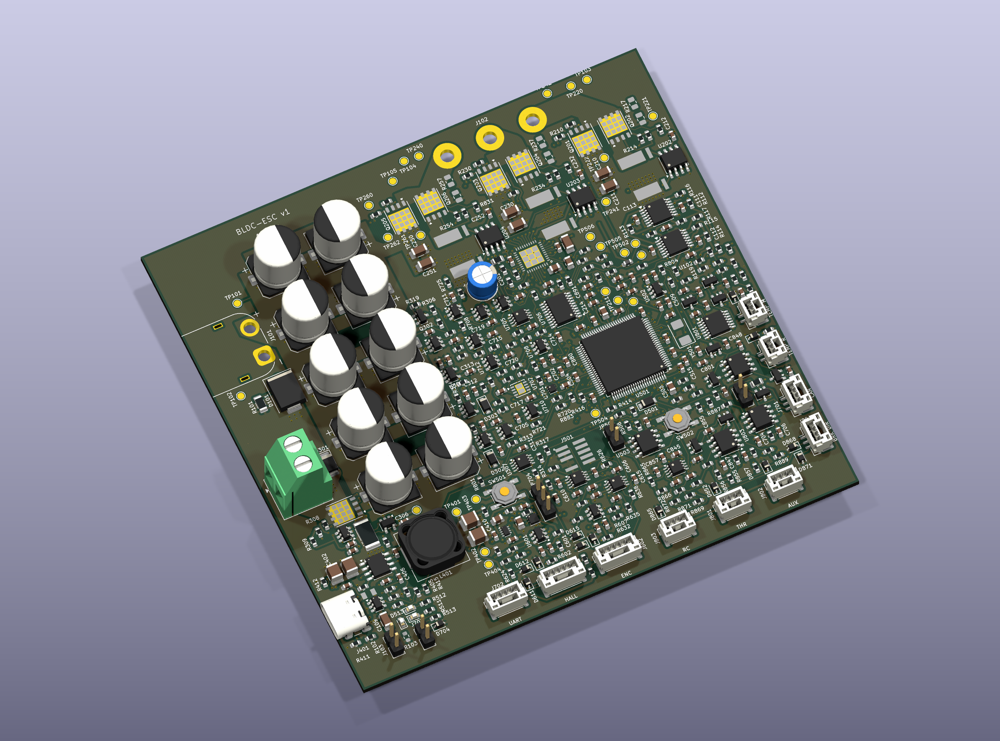

# BLDC ESC

i'm building a small vesc like controller for BLDC and PMSM motors. the first motor is a 26V Groschopp gearmotor, but i want the board to be useful for other motors too. Hall control first, then FOC later

## status

the schematic and first placement are done. it's 116 x 112 mm, with all 449 parts on top. the stm32 fanout, current-sense connections, gate-driver outputs and bridge power paths are routed. the DC-link, brake and buck loops, USB power, source mux and 3V3 regulator are connected too. the six PWM channels, driver SPI, enable and fault wiring are connected. the main watchdog, reset, hardware-enable and arm-latch wiring is routed, along with the core analog power feed. the primary current feedback, reference rails and comparator thresholds are connected now too, along with the driver diagnostic outputs and shunt inputs. the voltage dividers, buffers and temperature inputs are connected, including their ADC filters, local supplies, USB voltage detection and the 3V3 monitor. the brake clamp, overcurrent latch, local reference and remaining 5V bus branches are connected. the USB ground pair, bus bleed resistor and bus test point are connected too. brake-active status and the brake-current ADC now reach the MCU. the Hall and encoder input channels, their buffers, switched 5V supplies and enable/fault signals are routed too. the throttle and auxiliary analog inputs, RC PWM, brake and direction channels are connected too. the boot jumper and user button are connected now, along with more 3V3 branches, local CAN pull-ups, LED resistors and EEPROM wiring. the CAN connector, bus protection and jumper-controlled termination are routed too. 55 connections remain unrouted, including the CAN logic links to the MCU, other communications, programming and local wiring

the board hasn't been built yet. routing, mounting and cooling still need work before ordering it. i'm comparing PCBWay and JLCPCB for bare boards to assemble myself. the fab and exact layer stack aren't confirmed

**don't manufacture the devlog 03 snapshot (`dcad1e4`).** the XT60 connections were backwards in that version. the current design has pad 1 as GND and pad 2 as VBUS

devlogs are on [Half Life](https://halflife.hackclub.com/projects/cmuveje4m009201rvgvsn2jbz) and synced to [JOURNAL.md](https://github.com/EwoudVV/bldc-esc/blob/main/JOURNAL.md)

## hardware

- STM32G474VET6 and DRV8353S gate driver
- six 60V bridge MOSFETs and three 1 milliohm current shunts
- INA241 current sensing, voltage sensing and temperature inputs
- hardware current protection, watchdog and brake chopper
- Hall and encoder inputs, analog throttle, RC PWM and digital controls
- CAN FD, UART, USB-C and SWD
- XT60 power input, MT60 motor pigtail and JST-GH signal connectors

## targets

- 12-30V input, mainly for 6S batteries and 24V systems
- 15A RMS phase current with passive cooling, 20A with extra cooling
- around 40A peak, with the allowed duration still to be worked out
- four layers, with 2 oz outer copper and 1 oz inner copper planned

these current ratings are targets until thermal testing is done

## test motor

Groschopp / Blue-White BL6560-PS2120, P/N 930-23-9002:

- 26V, 0.75A nameplate
- 10W reducer output, 125 RPM, 6.68 in-lb torque
- 20:1 gearbox
- three phase leads and a separate sensor wire bundle

the OEM sensor pinout and motor measurements still need checking

## files

- `bldc-esc.kicad_pro`: open this in KiCad
- `schematic/`: the circuit sheets
- `bldc-esc.kicad_sym` and `bldc-esc.pretty/`: local symbols and footprints
- [bom.csv](bom.csv): component list, including the DNP flags
